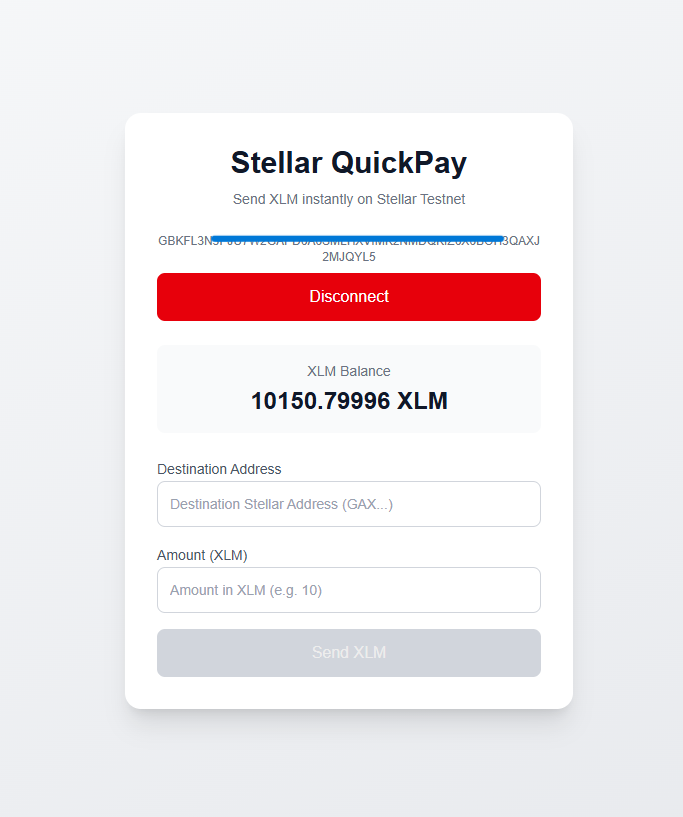
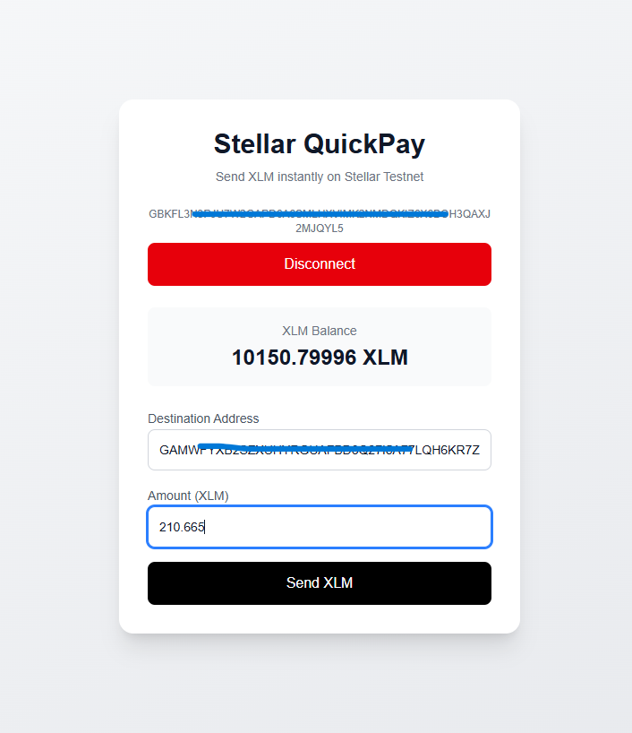
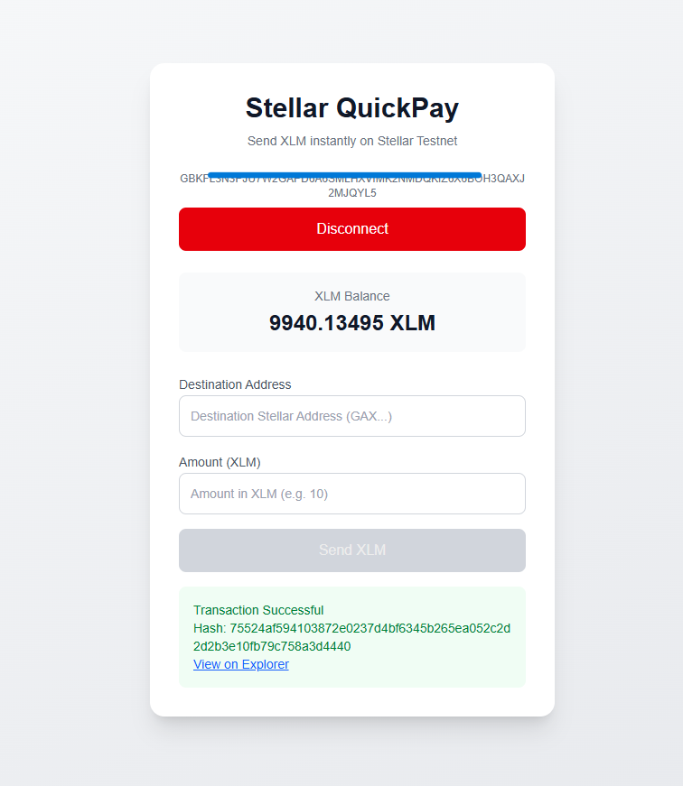
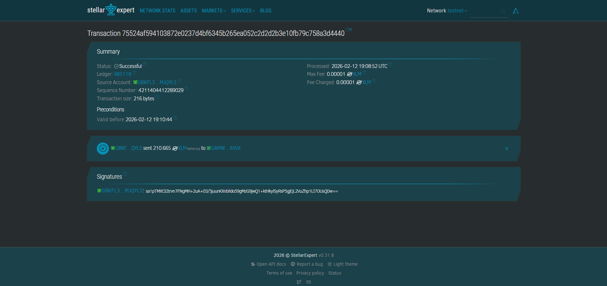

# Stellar QuickPay -- Testnet XLM Payment dApp

Stellar QuickPay is a simple decentralized application (dApp) built on
the Stellar Testnet.

This project demonstrates: - Wallet connection using Freighter -
Fetching and displaying XLM balance - Sending native XLM transactions -
Displaying transaction result and hash

This project was built as part of the Stellar Journey to Mastery --
White Belt level.

------------------------------------------------------------------------

## 🚀 Project Description

Stellar QuickPay allows users to:

1.  Connect their Freighter wallet (Testnet).
2.  View their current XLM balance.
3.  Send XLM to another Stellar address.
4.  View the transaction result and transaction hash after submission.

The application interacts directly with the Stellar Testnet via Horizon
and uses Freighter for secure transaction signing.

------------------------------------------------------------------------

## 🛠 Setup Instructions (Run Locally)

### 1️⃣ Clone the Repository

``` bash
git clone https://github.com/YOUR_USERNAME/YOUR_REPO_NAME.git
cd YOUR_REPO_NAME
```

### 2️⃣ Install Dependencies

``` bash
npm install
```

### 3️⃣ Run Development Server

``` bash
npm run dev
```

The app will run at:

http://localhost:3000

------------------------------------------------------------------------

## 🔐 Requirements

-   Install the **Freighter Wallet** browser extension.
-   Switch Freighter to **Testnet**.
-   Fund your testnet wallet using the Stellar Testnet Faucet.

Network used:

Test SDF Network ; September 2015

------------------------------------------------------------------------

## 📸 Screenshots

### 1️⃣ Wallet Connected State

Freighter wallet connected successfully and public key displayed.



------------------------------------------------------------------------

### 2️⃣ Balance Displayed

XLM balance fetched from Horizon Testnet and displayed in the UI.



------------------------------------------------------------------------

### 3️⃣ Successful Testnet Transaction

User sends XLM and the transaction is signed via Freighter.



------------------------------------------------------------------------

### 4️⃣ Explorer page proof

Transaction hash is displayed and can be verified on Stellar Testnet
Explorer.



------------------------------------------------------------------------

## 🧠 What This Project Demonstrates

-   Wallet integration with Freighter
-   Fetching account data from Horizon
-   Building transactions using Stellar SDK
-   Signing transactions securely via wallet
-   Submitting signed XDR to Horizon
-   Displaying success/failure feedback to the user
