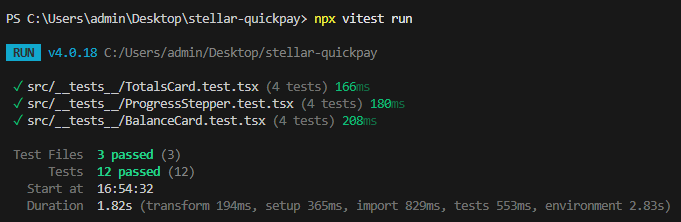
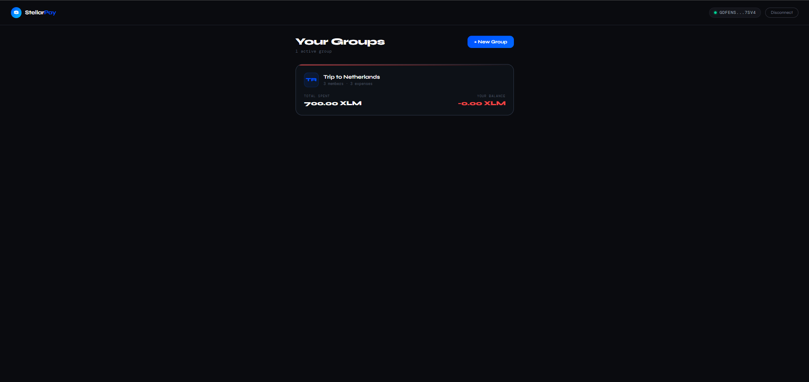
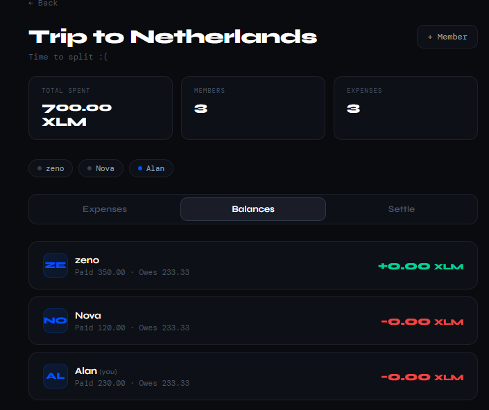
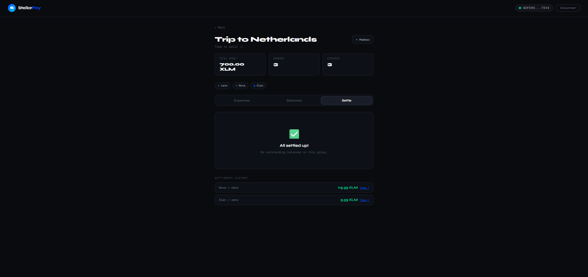

# StellarSplit 🌐

A decentralized bill-splitting dApp built on the Stellar network. Create groups, track shared expenses, and settle debts instantly with XLM — all recorded on-chain via a Soroban smart contract.

- **Live Demo:** https://stellar-quickpay.vercel.app
- **Network:** Stellar Testnet
- **Contract:** `CD3LLLCF2HT3WTUI552JWWZCBCRSQJNWB4HUHGK3W3DRAW4GYD4AB5T7`

---

## Demo Video

> 📹 [1-Minute Demo Walkthrough](https://www.loom.com/share/c3c4d73a92b04d079989f0f14afac789)

---

## Screenshots

### 12 Tests Passing


### App — Groups Dashboard


### App — Expense Splitting


### App — Balances & Settle


---

## How It Works

1. **Connect** your Freighter wallet (Stellar Testnet)
2. **Create a group** and add members by their Stellar address
3. **Add expenses** — choose who paid and split among any members
4. **Check balances** — the app calculates who owes who automatically
5. **Settle up** — send XLM directly to the person you owe, recorded on-chain
6. **View proof** — every settlement links to Stellar Explorer

### The Math

For each expense, the app divides the amount equally among the selected members. Each person's net balance is:

```
Net = Total Paid - Total Owed
```

Positive = you are owed money. Negative = you owe money. The settle tab uses a greedy algorithm to suggest the minimum number of transactions needed to zero everyone out.

---

## Verified Contract Calls

| Action | Transaction |
|--------|-------------|
| Settlement recorded on-chain | [`3613a532...`](https://stellar.expert/explorer/testnet/tx/3613a53247c3606e2cb6e57d3b13dbf4dec9a0528804a0f465b2d6228e3becc1) |

**Contract on Stellar Expert:** [View Contract](https://stellar.expert/explorer/testnet/contract/CD3LLLCF2HT3WTUI552JWWZCBCRSQJNWB4HUHGK3W3DRAW4GYD4AB5T7)

---

## Tech Stack

| Layer | Technology |
|-------|-----------|
| Frontend | Next.js 15, React 19, TypeScript |
| Styling | Inline styles, Syne + DM Mono fonts |
| Blockchain | Stellar Testnet, Soroban smart contract |
| Wallet | Freighter via `@stellar/freighter-api` |
| Contract SDK | `@stellar/stellar-sdk` v14 |
| Data Fetching | TanStack React Query v5 |
| Testing | Vitest + React Testing Library |
| Deployment | Vercel |

---

## Smart Contract

The Soroban contract (`PaymentTracker`) is written in Rust and deployed on Stellar Testnet. It exposes 3 functions:

```rust
// Record a payment for a user (requires auth)
pub fn record_payment(env: Env, user: Address, amount: i128)

// Get the global total of all payments recorded
pub fn get_total(env: Env) -> i128

// Get the total recorded for a specific user
pub fn get_user_total(env: Env, user: Address) -> i128
```

Every time a user settles a debt, the XLM transfer is submitted to Horizon and the amount is recorded in the contract — creating an immutable on-chain proof of payment.

---

## Tests

12 tests across 3 test files covering all core UI components:

```
✓ src/__tests__/TotalsCard.test.tsx     (4 tests)
✓ src/__tests__/ProgressStepper.test.tsx (4 tests)  
✓ src/__tests__/BalanceCard.test.tsx    (4 tests)
```

Run tests:
```bash
npx vitest run
```

---

## Project Structure

```
src/
├── app/
│   ├── page.tsx              # Landing page
│   ├── groups/
│   │   ├── page.tsx          # Groups dashboard
│   │   ├── new/page.tsx      # Create group
│   │   └── [id]/page.tsx     # Group detail (expenses, balances, settle)
│   └── settle/page.tsx       # Settlement flow (real contract call)
│
├── components/
│   ├── Header.tsx            # Navigation + wallet status
│   ├── BalanceCard.tsx       # XLM balance display
│   ├── TotalsCard.tsx        # Contract totals
│   ├── ProgressStepper.tsx   # Transaction progress UI
│   ├── SendPayment.tsx       # Payment form
│   ├── EventPanel.tsx        # Live contract events
│   └── WalletButton.tsx      # Wallet connect button
│
├── hooks/
│   ├── useWallet.ts          # Wallet connection + session persistence
│   ├── useSettle.ts          # Settlement flow (XLM + contract)
│   ├── useTotals.ts          # Contract data via React Query
│   └── usePayment.ts         # Payment state machine
│
└── lib/
    ├── stellar.ts            # XLM balance + sendXlm
    ├── contract.ts           # Soroban contract calls
    ├── storage.ts            # Group/expense localStorage helpers
    └── wallet.ts             # Freighter connection
```

---

## Getting Started

### Prerequisites

- [Node.js](https://nodejs.org/) v18+
- [Freighter Wallet](https://www.freighter.app/) browser extension
- Freighter set to **Testnet** (Settings → Network → Testnet)
- Testnet XLM from [Stellar Friendbot](https://friendbot.stellar.org)

### Installation

```bash
# Clone the repo
git clone https://github.com/faheem-mukri/stellar-quickpay.git
cd stellar-quickpay

# Install dependencies
npm install

# Add environment variables
cp .env.example .env.local
# Fill in your values (see below)

# Run locally
npm run dev
```

Open [http://localhost:3000](http://localhost:3000)

### Environment Variables

```env
NEXT_PUBLIC_CONTRACT_ID=CD3LLLCF2HT3WTUI552JWWZCBCRSQJNWB4HUHGK3W3DRAW4GYD4AB5T7
NEXT_PUBLIC_SOROBAN_RPC=https://soroban-testnet.stellar.org
NEXT_PUBLIC_NETWORK_PASSPHRASE=Test SDF Network ; September 2015
NEXT_PUBLIC_HORIZON=https://horizon-testnet.stellar.org
```

---

## Orange Belt Checklist ✅

- [x] Mini-dApp fully functional (multi-page, real contract calls)
- [x] 12 tests passing (3 test files, 4 tests each)
- [x] README complete with live demo, contract address, tx hash
- [x] Demo video recorded
- [x] 3+ meaningful commits
- [x] Deployed on Vercel
- [x] Loading states and progress indicators (ProgressStepper)
- [x] Basic caching (React Query with `staleTime`)
- [x] On-chain settlement proof (Stellar Explorer links)

---

## Commit History

| Commit | Description |
|--------|-------------|
| `feat: wallet connection and XLM balance` | Level 1 — White Belt foundation |
| `feat: contract integration and event tracking` | Level 2 — Yellow Belt |
| `feat: StellarSplit — group expense splitting dApp` | Level 3 — Orange Belt |

---

## Links

- [Stellar Expert — Contract](https://stellar.expert/explorer/testnet/contract/CD3LLLCF2HT3WTUI552JWWZCBCRSQJNWB4HUHGK3W3DRAW4GYD4AB5T7)
- [Verified Settlement TX](https://stellar.expert/explorer/testnet/tx/3613a53247c3606e2cb6e57d3b13dbf4dec9a0528804a0f465b2d6228e3becc1)
- [Freighter Wallet](https://www.freighter.app/)
- [Soroban Docs](https://soroban.stellar.org)
- [Stellar Friendbot](https://friendbot.stellar.org)

---

Built for **Stellar Journey to Mastery — Orange Belt 🟠** · 2026