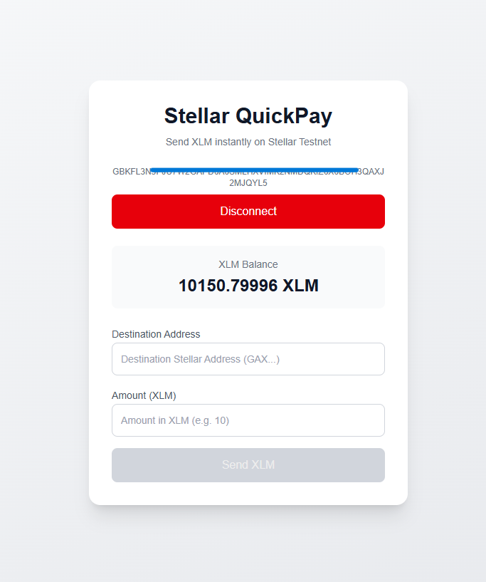
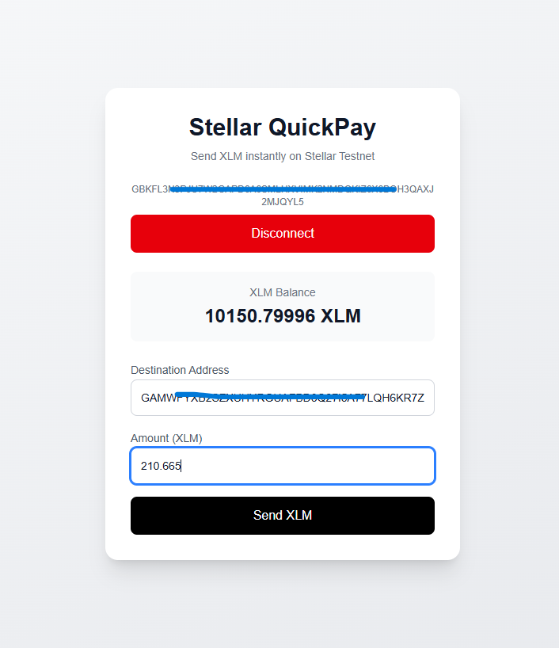
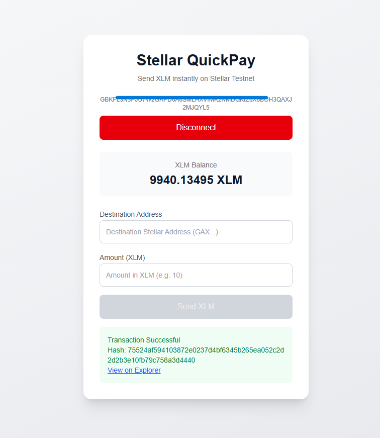
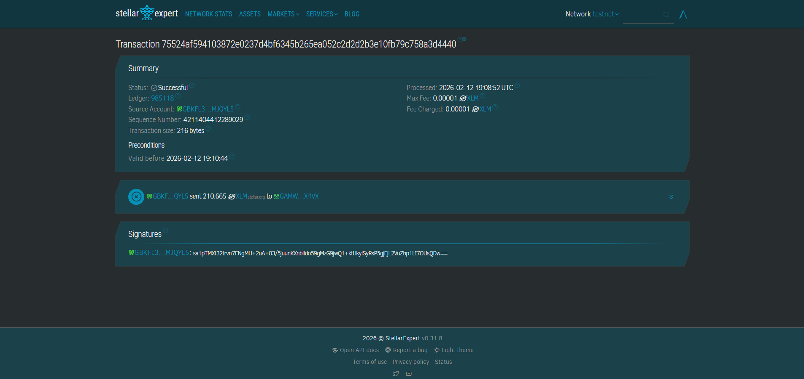

# Stellar QuickPay -- Soroban Payment Tracker (Testnet)

Stellar QuickPay is a decentralized application (dApp) built on the Stellar Testnet that allows users to:
Connect their Freighter wallet
Send native XLM transactions
Record payments on-chain using a Soroban smart contract
View contract-wide payment totals
View user-specific payment totals
Auto-refresh contract events in real time
This project was built as part of the Stellar Journey to Mastery — White & Yellow Belt Levels.

------------------------------------------------------------------------

## 🚀 Features

Wallet Integration
Freighter wallet connection
Secure transaction signing
Testnet-only support

💸 XLM Transfer

Native XLM payments
Horizon submission
Transaction hash display
Explorer deep linking

🟡 Soroban Smart Contract Integration

Record payments on-chain
get_total() contract read
get_user_total(address) contract read
i128 handling via BigInt

📡 Real-Time Event Polling

Auto-refresh every 5 seconds
Live contract event updates
Clean interval cleanup (no memory leaks)

⚙ Production Improvements

Environment variables
Proper state separation
Modular architecture
Confirmation-ready transaction handling

------------------------------------------------------------------------

## 🏗 Architecture
    src/
 ├── app/
 ├── components/
 │   ├── WalletButton.tsx
 │   ├── BalanceCard.tsx
 │   ├── TotalsCard.tsx
 │   ├── SendPayment.tsx
 │   └── EventPanel.tsx
 ├── lib/
 │   ├── wallet.ts
 │   ├── transaction.ts
 │   ├── contract.ts
 │   └── events.ts

------------------------------------------------------------------------
## 🛠 Tech Stack

Next.js (App Router)
TypeScript
Tailwind CSS
Stellar SDK
Soroban RPC
Horizon Testnet
Freighter Wallet

------------------------------------------------------------------------

## 🔗 Smart Contract Details

Contract ID:
CD3LLLCF2HT3WTUI552JWWZCBCRSQJNWB4HUHGK3W3DRAW4GYD4AB5T7

## 🛠 Setup Instructions (Run Locally)

### 1️⃣ Clone the Repository

``` bash
git clone https://github.com/faheem-mukri/stellar-quickpay.git
cd stellar-quickpay
```

### 2️⃣ Install Dependencies

``` bash
npm install
```

### 3️⃣ Run Development Server

``` bash
npm run dev
```

The app will run at:

http://localhost:3000

------------------------------------------------------------------------

## 🔐 Environment Variables

Create .env.local:
NEXT_PUBLIC_CONTRACT_ID=CD3LLLCF2HT3WTUI552JWWZCBCRSQJNWB4HUHGK3W3DRAW4GYD4AB5T7
NEXT_PUBLIC_SOROBAN_RPC=https://soroban-testnet.stellar.org
NEXT_PUBLIC_NETWORK_PASSPHRASE=Test SDF Network ; September 2015
NEXT_PUBLIC_HORIZON=https://horizon-testnet.stellar.org

------------------------------------------------------------------------

## 🔐 Requirements

-   Install the **Freighter Wallet** browser extension.
-   Switch Freighter to **Testnet**.
-   Fund your testnet wallet using the Stellar Testnet Faucet.

Network used:

Test SDF Network ; September 2015

------------------------------------------------------------------------

## 📸 Screenshots

### 1️⃣ Wallet Connected State

Freighter wallet connected successfully and public key displayed.



------------------------------------------------------------------------

### 2️⃣ Balance Displayed

XLM balance fetched from Horizon Testnet and displayed in the UI.



------------------------------------------------------------------------

### 3️⃣ Successful Testnet Transaction

User sends XLM and the transaction is signed via Freighter.



------------------------------------------------------------------------

### 4️⃣ Explorer page proof

Transaction hash is displayed and can be verified on Stellar Testnet
Explorer.



------------------------------------------------------------------------

## 🎯 Stellar Journey Progress

✅ White Belt — Wallet + XLM Transfer
✅ Yellow Belt — Smart Contract Deployment + Read Integration
🔜 Orange Belt — Enhanced transaction confirmation + advanced event filtering
🔜 Green Belt — Full production dApp enhancements
